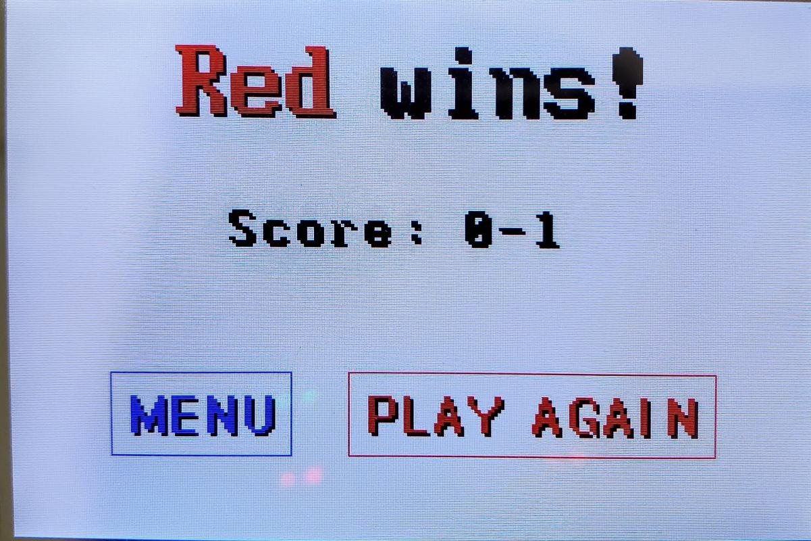

# Connect 4 - Computer architectures semestrial project (CVUT)

A low-level implementation of the classic **Connect 4 game**, developed for the **MicroZed APO board**, focusing on peripheral use.

Developed by **Yordan YORDANOV** and **Marie-Ange ROUSSEAU** for the Computer architectures class in Czech Technical University in Prague (CVUT).    

*(May 2025)* 

---

## 🎮 Introduction

This project implements a two-player Connect 4 game on the **MZ_APO board**, utilizing peripherals such as:

- LCD display
- Rotary encoders
- RGB LEDs
- 32 LED line
- Piezo speaker

The system is written entirely in **C** and is structured around a **finite state machine (FSM)** to manage game flow and interface transitions. User interaction is handled through rotary encoders, with visual feedback on the LCD and LEDs, and audio cues via the speaker.

---

## 🎬 Video

[](https://files.yourdan.uk/api/public/dl/wkLFcfK-?inline=true)

---

## 🔗 Traceability

For a complete overview of the project, including code, documentation, schematics, and screenshots, visit:  
[https://connect4.yourdan.uk](https://connect4.yourdan.uk)

---

## 🏗️ Application Architecture

### 📊 Block Diagram
A modular overview showing interactions between source files and subsystems.


### 🔄 Game Finite State Machine
The FSM represents modes of the application and transitions based on user actions and game logic.


---

## 🕹️ User Manual

### 📺 Main Menu
  
Press the red button to start a game or the green one to view instructions.

### 📖 Instructions
   
Scroll with the red knob. Return to menu with the blue button.

### 🎯 Game Grid Screen
  
Rotate the red knob to select a column, press red button to drop a disc.  

  
RGB LEDs indicate the current player.

### 🏆 Game Over
  
Displays winner and score. Red button to replay, blue to return to menu.

---

## 🛠️ Build & Execution Instructions

### 🐧 Debian-based Linux Distributions

#### 1️⃣ Install ARMv7 Cross-Compiler
```bash
sudo apt install crossbuild-essential-armhf
```

#### 2️⃣ Copy the private key for SSH connection to the MZ_APO kit where "ctu_login" is your KOS account
```bash
scp ctu_login@postel.felk.cvut.cz:/opt/zynq/ssh-connect/mzapo-root-key ~/.ssh/
chmod go-rwx ~/.ssh/mzapo-root-key
ssh-add ~/.ssh/mzapo-root-key
```

#### 3️⃣ Install make
```bash
sudo apt install make
```

#### 4️⃣ Install git
```bash
sudo apt install git
```

#### 5️⃣ Clone the repository
```bash
git clone https://github.com/thr33bricks/Connect4-mcu/
cd codebase
```

#### 6️⃣ Build and execute the project
```bash
make run TARGET_IP={BOARD_IP}
```
